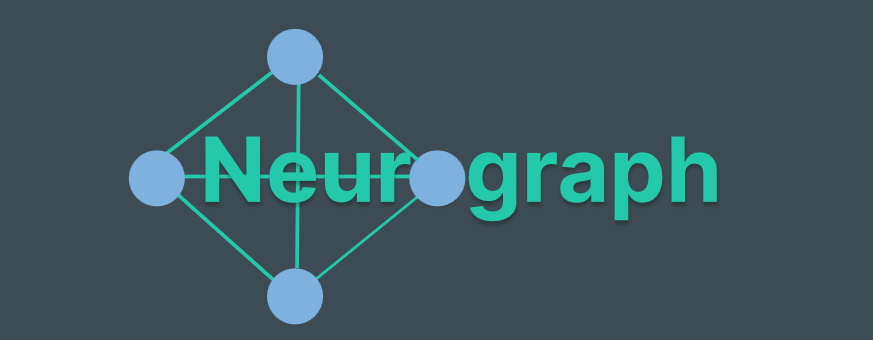
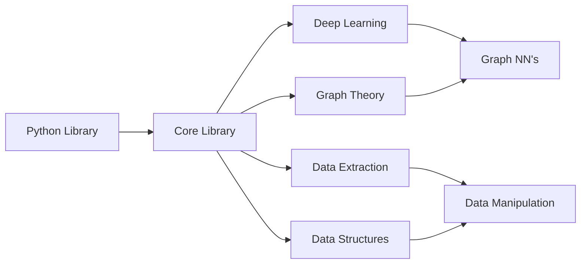
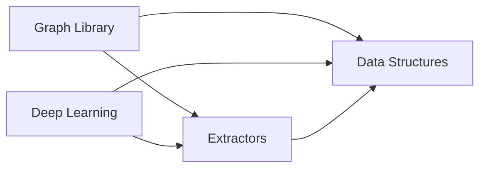

# 

* Experiment and research algorithms in graph theory and understand it's applications
* Use graph theory concepts for deep learning architectures
* Create data manipulation tools that utilize graph representations

# Table of Contents

* [Data Extraction](Projects/Neurograph/Design/Data%20Extraction/Data%20Frame.md)
* [Data Structures](Set.md)
* [Deep Learning](Deep%20Learning/MLP)
* [Graph Algorithms](Algorithms.md)
* [User Interface](User%20Interface/User%20Interface)

# Design

* Internal map of the core library behind neurograph
* Python library acts as high level user interface for core library
* Allows users to create GNN's and manipulate data 
* Build data pipelines with graph theory concepts

# Dependency Structure

* Dependency structure of the code for neurograph
* Graph and Deep learning library should depend on data structures and extractors
* Data structures and extractors should not depend on the graph or DL library

