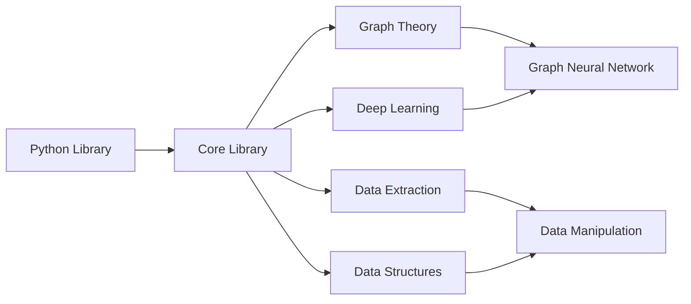

# Welcome to Neurograph

Neurograph is a graph deep learning library. This library is still in the early phases of development and will evolve over time. This can be thought of as a toy project for combining concepts from graph theory and deep learning.

## Purpose

* Experiment and research algorithms in graph theory and understand it's applications
* Tie concepts from graph theory to deep learning
* Data manipulation tool that utilize graph representations
* Invent a new graph neural network architecture
* Framework to visualize graphs

## Installation and Setup

```bash 
git clone https://github.com/shaysingh818/Neurograph.git
cd src/
sudo make install
```

## Usage

```C

   /* create dataframe from csv file */
    frame_t *iris = dataframe("iris.csv", 1024, 150, ","); 
    if(iris->status != true){
        printf("Error creating frame\n"); 
    }

    /* select cols to use */
    array_t *selected_cols = init_array(); 
    insert_char(selected_cols, "f1"); 
    insert_char(selected_cols, "f2");
    insert_char(selected_cols, "f3");
    insert_char(selected_cols, "f4");

    mat_t *inputs = frame_to_matrix(iris, selected_cols);  
    value_t *input = value(inputs);

    /* select output cols to use */
    array_t *output_cols = init_array(); 
    insert_char(output_cols, "f5"); 
    mat_t *outputs = frame_to_matrix(iris, output_cols);  

    /* create network */
    double learning_rate = 0.01; 
    net_t *nn = init_network(learning_rate, input, 4); 
    layer(nn, linear(4, 5));
    layer(nn, activation(4, 5, "tanh")); 
    layer(nn, linear(5, 1)); 
    layer(nn, activation(5, 1, "tanh"));
    batch_train(nn, 10000, outputs, true);

    /* batch inputs and outputs */
    mat_t **x_train = batch_matrix(input->val, 4); 
    mat_t **y_train = batch_matrix(outputs, 4);

    /* predict and get results*/
    int row = 30;
	mat_t *results = predict(nn, x_train[row]); 	

    printf("Expected\n"); 
    print_vec(y_train[row]); 
    printf("Actual\n"); 
    print_vec(results); 

```

## Design



## Common Use Cases

* Require the ability to represent datasets as graphs to understand the relationships between features
* Expirmenting with graph algorithms for creating neural network architectures

