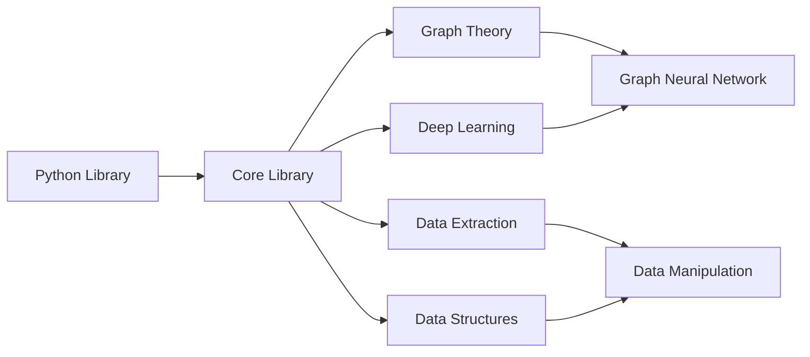

# Welcome to Neurograph

Neurograph is a graph deep learning library. This library is still in the early phases of development and will evolve over time. This started out as a toy project for learning graph theory and deep learning. Currently it's core library written in C with high level usage in Python. 

## Purpose

* Experiment and research algorithms in graph theory and understand it's applications
* Tie concepts from graph theory to deep learning
* Data manipulation tool that utilize graph representations
* Invent a new graph neural network architecture
* Framework to visualize graphs


## Installation and Setup

`pip install neurograph==1.0.0`


## Usage

```python
from ng.extractors import frame, operations, re
from ng.graph import community, search, pathfinding
from ng.networks import MultiLayerPerceptron


# Frame usage example
df = ng.DataFrame("../pathtofile", 1024, ",")
df.select_cols()


```

## Design



## Common Use Cases

* Require the ability to represent datasets as graphs to understand the relationships between features
* Expirmenting with graph algorithms for creating neural network architectures

